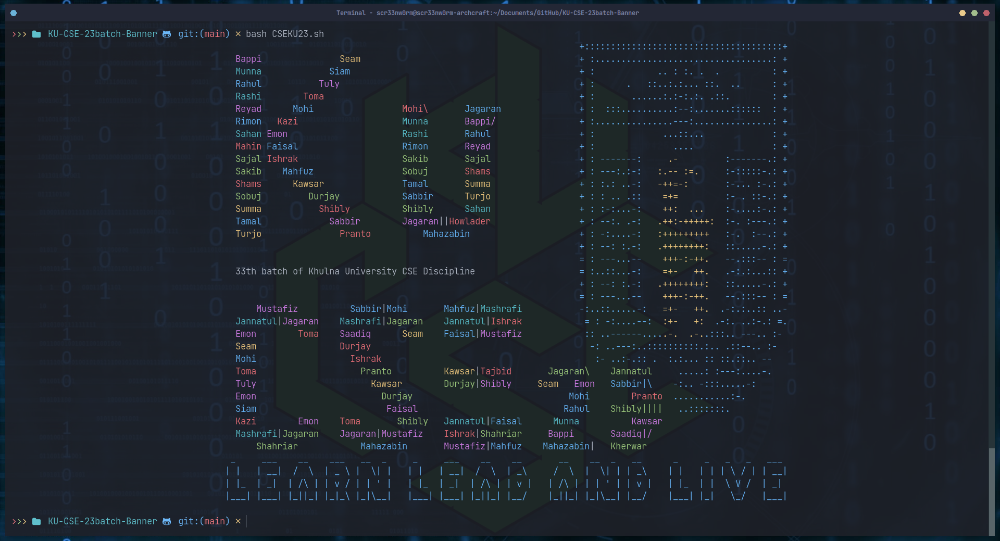

# KU-CSE-23batch-Banner
This repository contains the source code that I and my intelligent classmate, Ibnul Abrar Shahriar Seam contributed to make a shell(bash) script that will be used as the banner of Khulna University's CSE 23`batch.

it is sad to say goodbye to Moinul (x2302xx), future doctors Marufa Apa (x230216) (KMC) and Mahamud (x230241) (JAMC). We wish you success in your life.

Again, I want to thank 230201 for his support.   
but, thank you, Recursive-23.

---

Stargazers:  

Forkers:  

